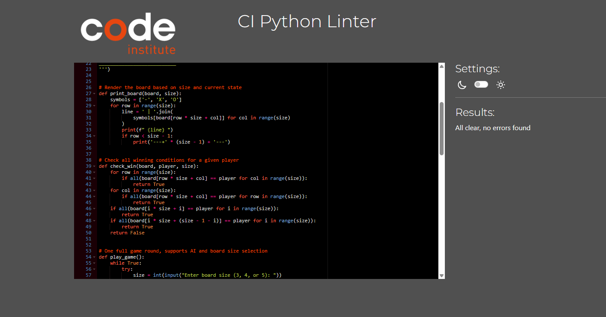

# 🎮 Tic-Tac-Toe

A Python-based command-line Tic-Tac-Toe game with support for custom board sizes and an optional AI opponent.

---

## 📜 Overview

Tic-Tac-Toe (also known as Noughts and Crosses or Xs and Os) is a classic two-player game. This implementation allows players to choose the board size (3x3, 4x4, or 5x5) and even play against a simple AI.

---

## 🕹️ How to Play

1. **Setup**: Player 1 uses 'X', Player 2 or AI uses 'O'.
2. **Objective**: Get all your symbols in a row (horizontal, vertical, or diagonal).
3. **Controls**:
   - Input a number corresponding to an empty position on the board.
   - Choose to play against another player or the AI.

To start the game:

```bash
python run.py
```

## 🎨 Color Scheme

As this is a command-line interface application, the color scheme is determined by the terminal in use. The game output uses plain text, 
typically rendered in the default terminal font and colors. No custom color styling is applied.

## 🔤 Typography

The typography is limited to the monospaced font used by the terminal or shell environment. There is no use of custom fonts or styles since this is a CLI-based game.


# 🎯 User Stories
As a user, I want a clear introduction and instructions so I can understand how to play.

As a user, I want to play on different board sizes for variety.

As a user, I want to challenge an AI if I don’t have a second player.

As a user, I want the game to validate my input so I don't break it.

As a user, I want to replay the game without restarting the program.

As a user, I want a message for wins and draws so I know when the game ends.


# 🧭 User Experience (UX)
Simple CLI interface for ease of use.

Dynamic board rendering depending on selected size.

Draw and win detection with clear output.

Replay option included at the end of every round.

Input validation ensures smooth, error-free experience.


# ✨ Features
✅ Existing Features
| Feature              | Description                                |
| -------------------- | ------------------------------------------ |
| Welcome Message      | Welcomes the user and explains the rules.  |
| Board Selection      | Users can choose 3x3, 4x4, or 5x5 board.   |
| AI Mode              | Optional AI opponent for solo play.        |
| Input Validation     | Prevents invalid entries or taken spots.   |
| Replay Option        | Restart the game without rerunning script. |
| Win & Draw Detection | Declares outcome clearly.                  |


# 📷 Few Ingame Screenshots

| Feature | Description | Screenshot |
| :---: | :---: | :---: |
| **Welcoming message** | Welcome message and some simple game rules. | |
| **Invalid input** | Player must choose numbers from 1 to 9 otherwise this message will be shown. | |
| **Draw** | If all cells are filled and no player has won, the game ends in a draw. | |
| **Already taken position** | Players are not allowed to repeat same number twice or use letter. | |
| **Player wins** | Wining message. | |

🛠️ # Tools & Technologies Used

- [Python](https://www.python.org/) used for the main program content.
- [Git](https://git-scm.com) used for version control. (`git add`, `git commit`, `git push`,`git pull`)
- [GitHub](https://github.com) used for secure online code storage.
- [Heroku](https://www.heroku.com) used for hosting the deployed front-end site.
- [Pi] (https:/www.pi.ai/talk) used for finding faults with syntax and indentation.


# 🧪 Testing
All game functionality was manually tested through CLI.

Key Tests Performed:
✅ Valid and invalid inputs

✅ Draw conditions on full board

✅ Win detection across all board sizes

✅ AI placement and response

✅ Replay prompt after game end

✅ PEP8 compliance checked with CI linter


# Code Validation

### Python 🐍

I have used the recommended [PEP8 Validaton](https://pep8ci.herokuapp.com/#) to validate my Python file.

| Page | Screenshot | Notes |
| :---: | :---: | :---: |
| Index | | All clear, no errors found.|

# 🚀 Deployment
The app is hosted on Heroku.
You can play the game directly in the deployed CLI app:

- [Heroku App Link](https://dinok94-xs-and-xo-project-929df1ab38b5.herokuapp.com/)

# 📚 Credits
## Content & Learning Resources

### Content and Code

| Source | Location | Notes |
| --- | --- | --- |
| [Python.org](https://www.python.org) | Research | learning functions |  
| [YouTube](https://www.youtube.com/watch?v=WZNG8UomjSI&t=1783s) | Research | better understanding of many functions |
| [Stack Overflow](https://stackoverflow.com/) | Research | more Python research |
| [She Codes](https://shecodes.io/) | Research | more Python research |
| [Geeks for Geeks](https://geeksforgeeks.org/) | Research | more Python research |
| [Pi](https:/www.pi.ai/talk) | Validation | additional Python research and checking for syntax and indentation errors |


# 🔮 Future Improvements
Add difficulty levels to AI

Implement online multiplayer

Save match results and stats

Add a GUI version using Tkinter or PyGame


 
